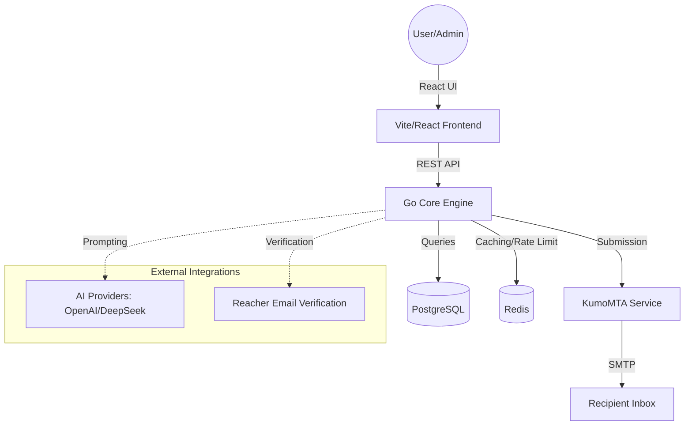

<p align="center">
  
</p>

# SampMail

### The Self-Hosted Email Marketing Platform Built for Speed and Control.

SampMail is a high-performance, self-hosted email marketing platform built with **Go** and **React**. It gives you complete control over your email infrastructure, subscriber data, and sending pipeline. No per-email fees, no third-party data access—just raw power and full sovereignty.

> [!IMPORTANT]
> **Universal One-Liner Installation** (Ubuntu, Debian, Rocky, Alma, RHEL 9):
> ```bash
> curl -fsSL https://raw.githubusercontent.com/pulak-ranjan/sampmail/main/scripts/install.sh | bash -s -- --with-kumomta
> ```

---

## ⚡ Key Features

*   **🚀 High-Performance Sending**: Integrated with **KumoMTA** for massive throughput and professional-grade delivery.
*   **🤖 AI-Powered**: Built-in AI assistant (**Anike**) for campaign generation and management (OpenAI, Anthropic, Gemini, DeepSeek).
*   **📊 Real-time Analytics**: Atomic tracking for opens and clicks with HMAC-signed security.
*   **🏢 Multi-Tenancy**: Full organization isolation with role-based access control (RBAC).
*   **🛠️ Automation Engine**: Visual workflow triggers, drip sequences, and behavioral branching.
*   **✅ Verified Delivery**: Automatic bounce classification, DKIM signing, and suppression list enforcement.
*   **🎨 Template Builder**: Support for MJML and raw HTML with powerful merge-tag personalization.

---

## 🏗️ Architecture & Workflow

SampMail is designed with a modular architecture to ensure scalability and reliability.



---

## 🚀 Quick Start

### Direct Installation (Recommended)
Our universal script handles Go, Node.js, PostgreSQL, KumoMTA, and SSL setup automatically.

```bash
# Update and Install
sudo apt update && sudo apt install -y curl
curl -fsSL https://raw.githubusercontent.com/pulak-ranjan/sampmail/main/scripts/install.sh | bash -s -- --with-kumomta
```

### Docker Compose
```bash
git clone https://github.com/pulak-ranjan/sampmail.git
cd sampmail
cp .env.example .env # Set your secrets
sudo docker compose up -d
```

---

## 📖 Documentation

| Document | Description |
| :-- | :-- |
| 🚀 [**Installation**](docs/INSTALLATION.md) | Detailed server setup and OS-specific guides. |
| ⚙️ [**Configuration**](docs/CONFIGURATION.md) | Environment variable reference and hardening. |
| 🔌 [**API Reference**](docs/API.md) | REST API endpoints for external integrations. |
| 📐 [**Architecture**](docs/ARCHITECTURE.md) | Deep dive into system design and data flow. |
| 🔒 [**Security**](docs/SECURITY.md) | Encryption standards and security best practices. |

---

## 📡 API at a Glance

SampMail provides a modern REST API for deep integration.

```bash
# Authenticate & Get Token
curl -X POST https://your-app.com/api/auth/login \
  -d '{"email":"admin@domain.com", "password":"..."}'

# Fetch Campaign Stats
curl -H "Authorization: Bearer <TOKEN>" \
  https://your-app.com/api/v2/campaigns/stats
```

---

## 🤝 Contributing

We welcome contributions! Please see our [Contributing Guide](docs/CONTRIBUTING.md) to get started.

---

## ⚖️ License

SampMail is licensed under the **GNU Affero General Public License v3.0 (AGPL-3.0)**. For commercial white-labeling or private modifications, please contact `cloudnesh@gmail.com`.

---

<p align="center">
  Built with ❤️ by the SampMail Team.
</p>
