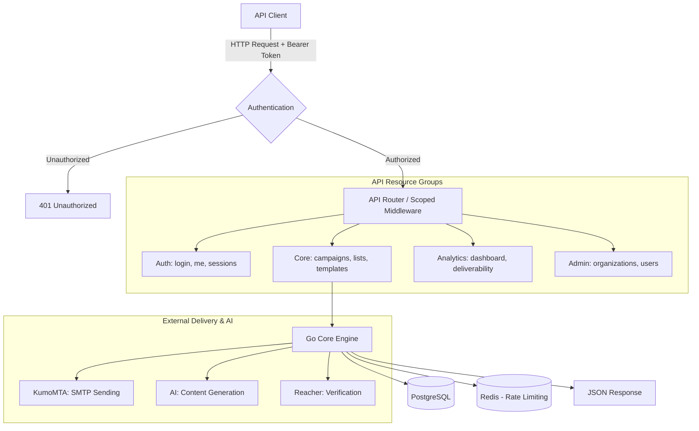

# SampMail API Reference

All API communication uses JSON. All endpoints require an `Authorization` header
with a valid session token unless stated otherwise.

```
Authorization: Bearer <session-token>
```

The base URL depends on your deployment. Examples in this document use:

```
http://localhost:9000
```

---

## Table of Contents

- [Authentication](#authentication)
- [Dashboard](#dashboard)
- [Settings](#settings)
- [Domains and Senders](#domains-and-senders)
- [Campaigns V2](#campaigns-v2)
- [Contact Lists V2](#contact-lists-v2)
- [Contacts and Import](#contacts-and-import)
- [Templates V2](#templates-v2)
- [Suppressions V2](#suppressions-v2)
- [Automations V2](#automations-v2)
- [Webhooks V2](#webhooks-v2)
- [Analytics V2](#analytics-v2)
- [Organizations (Superadmin)](#organizations-superadmin)
- [Users (Superadmin)](#users-superadmin)
- [System and Health](#system-and-health)
- [Tracking Endpoints](#tracking-endpoints)
- [Error Format](#error-format)
 
---
 
## API Architecture & Request Flow



---

## Authentication

### Register

```
POST /api/auth/register
```

Body:

```json
{
  "email": "admin@example.com",
  "password": "minimum8chars1"
}
```

The first registered user is automatically assigned the superadmin role.

Response:

```json
{
  "token": "<session-token>",
  "user": {
    "id": 1,
    "email": "admin@example.com",
    "is_super_admin": true
  }
}
```

---

### Login

```
POST /api/auth/login
```

Body:

```json
{
  "email": "admin@example.com",
  "password": "your-password"
}
```

If 2FA is enabled, the response contains a `requires_2fa: true` field and a temporary
token. Use that token to call `POST /api/auth/verify-2fa`.

Response (no 2FA):

```json
{
  "token": "<session-token>",
  "user": { "id": 1, "email": "admin@example.com", "is_super_admin": false }
}
```

---

### Verify 2FA

```
POST /api/auth/verify-2fa
```

Rate-limited. Locked after repeated failures.

Body:

```json
{
  "token": "<temp-token-from-login>",
  "code": "123456"
}
```

Response: same as login without 2FA.

---

### Get current user

```
GET /api/auth/me
```

Returns the authenticated user's profile.

---

### Logout

```
POST /api/auth/logout
```

Invalidates the current session token.

---

### List sessions

```
GET /api/auth/sessions
```

Returns all active sessions for the current user, including IP address and User-Agent.

---

### Setup 2FA

```
POST /api/auth/setup-2fa
```

Returns a TOTP secret and a `otpauth://` URI for QR code generation. The secret is
not yet active until `enable-2fa` is called with a valid code.

---

### Enable 2FA

```
POST /api/auth/enable-2fa
```

Body:

```json
{ "code": "123456" }
```

Activates 2FA for the current user after verifying the code.

---

### Disable 2FA

```
POST /api/auth/disable-2fa
```

Body:

```json
{ "code": "123456" }
```

---

## Dashboard

### Get dashboard statistics

```
GET /api/dashboard/stats
```

Returns aggregate counts: total contacts, campaigns, sent emails, open rate,
bounce rate, and recent campaign summaries.

---

## Settings

### Get app settings

```
GET /api/settings
```

Returns the global AppSettings record including the configured hostname, SMTP settings,
AI provider, and webhook configuration.

---

### Update app settings

```
POST /api/settings
```

Body fields (all optional, sends only what you want to change):

```json
{
  "main_hostname": "mail.yourdomain.com",
  "main_server_ip": "203.0.113.42",
  "webhook_url": "https://hooks.example.com/sampmail",
  "webhook_enabled": true,
  "bounce_alert_pct": 5
}
```

---

## Domains and Senders

### List domains

```
GET /api/domains
```

### Create domain

```
POST /api/domains
```

Body:

```json
{
  "name": "example.com",
  "mail_host": "mail.example.com",
  "bounce_host": "bounce.example.com"
}
```

### Get / Update / Delete domain

```
GET    /api/domains/{id}
PUT    /api/domains/{id}
DELETE /api/domains/{id}
```

### List senders for a domain

```
GET /api/domains/{domainID}/senders
```

### Create sender

```
POST /api/domains/{domainID}/senders
```

Body:

```json
{
  "local_part": "newsletter",
  "ip": "203.0.113.42"
}
```

The resulting sender email address is `local_part@domain.name`.

### Get / Update / Delete sender

```
GET    /api/senders/{id}
PUT    /api/senders/{id}
DELETE /api/senders/{id}
```

### Run sender setup (DKIM generation)

```
POST /api/domains/{domainID}/senders/{id}/setup
```

Generates a DKIM key pair, writes the private key to the KumoMTA DKIM directory, and
returns the public key DNS record to publish.

---

## Campaigns V2

All campaign endpoints are scoped to an organization. Include the organization ID in
requests where required.

### List campaigns

```
GET /api/v2/campaigns
```

Query parameters: `page`, `per_page`, `status` (draft|scheduled|sending|completed|failed).

### Campaign statistics summary

```
GET /api/v2/campaigns/stats
```

Returns aggregated totals across all campaigns: total sent, total opens, total clicks,
average open rate, average click rate.

### Create campaign

```
POST /api/v2/campaigns
```

Body:

```json
{
  "name": "March Newsletter",
  "subject": "What is new in March",
  "body": "<h1>Hello {{first_name}}</h1>...",
  "sender_id": 3,
  "organization_id": 1,
  "scheduled_at": "2025-03-01T09:00:00Z"
}
```

Leave `scheduled_at` empty to keep the campaign as a draft.

### Get / Update / Delete campaign

```
GET    /api/v2/campaigns/{id}
PUT    /api/v2/campaigns/{id}
DELETE /api/v2/campaigns/{id}
```

Deletion is only permitted for campaigns in `draft` status.

### Preview campaign

```
POST /api/v2/campaigns/{id}/preview
```

Body:

```json
{ "email": "test@example.com" }
```

Sends a rendered preview to the specified address using the first contact in the
recipient list for variable substitution.

---

## Contact Lists V2

### List all subscriber lists

```
GET /api/v2/lists
```

### Create list

```
POST /api/v2/lists
```

Body:

```json
{
  "name": "Newsletter Subscribers",
  "description": "Main newsletter list",
  "organization_id": 1
}
```

### Get / Update / Delete list

```
GET    /api/v2/lists/{id}
PUT    /api/v2/lists/{id}
DELETE /api/v2/lists/{id}
```

### List subscribers in a list

```
GET /api/v2/lists/{id}/subscribers
```

Query parameters: `page`, `per_page`, `status` (active|unsubscribed|bounced).

### Add subscriber to a list

```
POST /api/v2/lists/{id}/subscribers
```

Body:

```json
{
  "email": "contact@example.com",
  "first_name": "Jane",
  "last_name": "Smith"
}
```

### Remove subscriber from list

```
DELETE /api/v2/lists/{id}/subscribers/{contactId}
```

### Import subscribers

```
POST /api/v2/lists/{id}/import
Content-Type: multipart/form-data
```

Upload a CSV file. Required columns: `email`. Optional: `first_name`, `last_name`,
`phone`, `company`, and any custom field names.

Maximum file size: 50 MB.

### Export subscribers

```
GET /api/v2/lists/{id}/export
```

Returns a CSV download of all active subscribers in the list.

### Get list statistics

```
GET /api/v2/lists/{id}/stats
```

Returns subscriber counts broken down by status.

---

## Contacts and Import

### Verify a single email address

```
POST /api/contacts/verify
```

Rate-limited.

Body:

```json
{ "email": "test@example.com" }
```

Response:

```json
{
  "email": "test@example.com",
  "is_reachable": "safe",
  "risk_score": 12,
  "is_disposable": false,
  "is_role_account": false,
  "is_catch_all": false
}
```

### Batch verify emails

```
POST /api/contacts/verify-batch
```

Body:

```json
{ "emails": ["a@example.com", "b@example.com"] }
```

### Clean a list (verify all contacts)

```
POST /api/lists/{id}/clean
```

Triggers verification of all unverified contacts in the list. Runs asynchronously.
Invalid addresses are added to the suppression list automatically.

### CSV import (synchronous, up to 1 MB)

```
POST /api/import/csv
Content-Type: multipart/form-data
```

### CSV import (asynchronous, up to 50 MB)

```
POST /api/import/csv/async
Content-Type: multipart/form-data
```

Returns a job ID.

### Check import status

```
GET /api/import/status/{jobId}
```

Returns progress: total rows, imported, skipped (invalid or suppressed), errors.

---

## Templates V2

### List templates

```
GET /api/v2/templates
```

### Create template

```
POST /api/v2/templates
```

Body:

```json
{
  "name": "Welcome Email",
  "subject": "Welcome to {{company_name}}",
  "html_content": "<html>...</html>",
  "organization_id": 1
}
```

### Get / Update / Delete template

```
GET    /api/v2/templates/{id}
PUT    /api/v2/templates/{id}
DELETE /api/v2/templates/{id}
```

### Built-in template library

```
GET /api/v2/templates/library
GET /api/v2/templates/library/{templateId}
```

Returns the set of built-in starter templates that ship with SampMail.

### Preview template

```
POST /api/v2/templates/{id}/preview
```

Body:

```json
{
  "variables": { "first_name": "Jane", "company_name": "Acme" }
}
```

---

## Suppressions V2

### List suppressions

```
GET /api/v2/suppressions
```

Query parameters: `page`, `per_page`, `reason`.

### Add suppression

```
POST /api/v2/suppressions
```

Body:

```json
{
  "email": "user@example.com",
  "reason": "manual",
  "organization_id": 1
}
```

### Remove suppression

```
DELETE /api/v2/suppressions/{id}
```

---

## Automations V2

### List automations

```
GET /api/v2/automations
```

### Create automation

```
POST /api/v2/automations
```

Body:

```json
{
  "name": "Welcome Series",
  "trigger_type": "subscribe",
  "trigger_config": { "list_id": 5 },
  "organization_id": 1,
  "nodes": [...],
  "edges": [...]
}
```

The `nodes` and `edges` fields use the React Flow JSON format as produced by the
visual automation builder in the UI.

### Get / Update / Delete automation

```
GET    /api/v2/automations/{id}
PUT    /api/v2/automations/{id}
DELETE /api/v2/automations/{id}
```

### Activate / Pause automation

```
POST /api/v2/automations/{id}/activate
POST /api/v2/automations/{id}/pause
```

### Get automation statistics

```
GET /api/v2/automations/{id}/stats
```

Returns counts: contacts entered, currently active, completed, failed.

### Get automation runs

```
GET /api/v2/automations/{id}/runs
```

Returns individual contact execution records with status and current node.

---

## Webhooks V2

### List webhooks

```
GET /api/v2/webhooks
```

### Create webhook

```
POST /api/v2/webhooks
```

Body:

```json
{
  "url": "https://hooks.example.com/endpoint",
  "is_active": true,
  "organization_id": 1
}
```

### Update / Delete webhook

```
PUT    /api/v2/webhooks/{id}
DELETE /api/v2/webhooks/{id}
```

### Test webhook URL

```
POST /api/v2/webhooks/test
```

Body:

```json
{ "url": "https://hooks.example.com/endpoint" }
```

Sends a test payload and returns the HTTP response code and body.

---

## Analytics V2

### Dashboard analytics

```
GET /api/v2/analytics/dashboard
```

Returns time-series data for sends, opens, clicks, bounces, and complaints over the
last 30 days, scoped to the organization.

### Deliverability metrics

```
GET /api/v2/analytics/deliverability
```

Returns per-domain deliverability statistics: sent count, open rate, bounce rate,
complaint rate.

---

## Organizations (Superadmin)

Requires `is_super_admin: true`.

### List all organizations

```
GET /api/v2/admin/organizations
```

### Create organization

```
POST /api/v2/admin/organizations
```

Body:

```json
{
  "name": "Acme Corp",
  "slug": "acme",
  "plan": "pro"
}
```

### Delete organization

```
DELETE /api/v2/admin/organizations/{id}
```

### Get organization members

```
GET /api/v2/admin/organizations/{id}/members
```

---

## Users (Superadmin)

### List users

```
GET /api/admin/users
```

### Create user

```
POST /api/admin/users
```

Body:

```json
{
  "email": "user@example.com",
  "password": "secure-password",
  "is_super_admin": false
}
```

### Update / Delete user

```
PUT    /api/admin/users/{id}
DELETE /api/admin/users/{id}
```

### Assign user to organization

```
POST /api/admin/users/{id}/organizations
```

Body:

```json
{
  "organization_id": 2,
  "role": "admin"
}
```

Valid roles: `owner`, `admin`, `editor`, `viewer`.

### Remove user from organization

```
DELETE /api/admin/users/{id}/organizations/{org_id}
```

---

## System and Health

### Health endpoints (no authentication required)

```
GET /health         Full health status of all subsystems.
GET /health/live    Kubernetes liveness probe. Returns 200 if the process is running.
GET /health/ready   Kubernetes readiness probe. Returns 200 when the database is connected.
```

### Detailed system health

```
GET /api/system/health
```

Returns status of: database, SMTP pool, Redis, Reacher, KumoMTA.

### Version information

```
GET /api/version
```

Response:

```json
{
  "version": "0.1.12",
  "build_time": "2025-01-15T10:30:00Z",
  "git_commit": "a1b2c3d"
}
```

### Prometheus metrics

```
GET /metrics
```

Standard Prometheus text format. Scraped by Prometheus or compatible systems.

---

## Tracking Endpoints

These endpoints are public (no authentication) and rate-limited.

### Track email open

```
GET /api/track/open/{recipientID}?sig={hmac}
```

Returns a 1x1 transparent GIF. The HMAC signature is validated. An invalid or missing
signature returns 403 without recording the event.

### Track link click

```
GET /api/track/click/{recipientID}?url={base64-encoded-url}&sig={hmac}
```

Validates the HMAC signature, records the click event, then issues a 302 redirect to
the original URL. An invalid signature returns 403.

### Unsubscribe page

```
GET  /api/unsubscribe/{token}   Returns the unsubscribe confirmation page.
POST /api/unsubscribe/{token}   Confirms the unsubscribe and adds to suppression list.
```

---

## Error Format

All errors return a JSON body with an `error` field:

```json
{
  "error": "invalid credentials"
}
```

**HTTP status codes used:**

| Code | Meaning |
|---|---|
| 200 | Success |
| 201 | Created |
| 204 | Success, no content (used for DELETE) |
| 400 | Bad request — invalid input |
| 401 | Unauthorized — missing or invalid session token |
| 403 | Forbidden — authenticated but not permitted |
| 404 | Not found |
| 409 | Conflict — e.g. duplicate email |
| 422 | Unprocessable entity — validation failed |
| 429 | Too many requests — rate limited |
| 500 | Internal server error |
