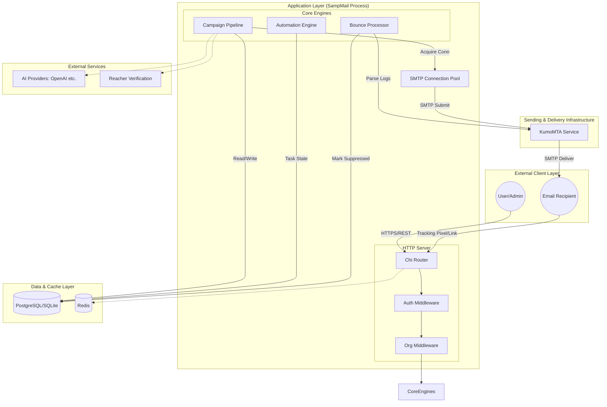

# SampMail Architecture

This document describes how SampMail is structured internally: how the code is
organized, how data flows through the system, and how each major subsystem works.

---

## Table of Contents

- [Repository Layout](#repository-layout)
- [Process Architecture](#process-architecture)
- [Request Lifecycle](#request-lifecycle)
- [Database Layer](#database-layer)
- [Campaign Pipeline](#campaign-pipeline)
- [Tracking System](#tracking-system)
- [Suppression and Unsubscribe](#suppression-and-unsubscribe)
- [Email Verification](#email-verification)
- [Bounce Processing](#bounce-processing)
- [Automation Engine](#automation-engine)
- [Webhook System](#webhook-system)
- [Multi-Tenancy](#multi-tenancy)
- [SMTP Connection Pool](#smtp-connection-pool)
- [Rate Limiting](#rate-limiting)
- [Background Scheduler](#background-scheduler)
- [Secret Derivation](#secret-derivation)

---

## System Architecture Overview



---

## Repository Layout

```
sampmail/
  cmd/
    server/
      main.go          Entry point. Initialises everything and starts the HTTP server.
  internal/
    api/               HTTP handlers. One file per domain (auth.go, campaigns.go, etc.)
    config/            Configuration struct and environment variable parsing.
    core/              Business logic: campaign sending, bounce processing, automation.
    logger/            Structured logger wrapper.
    middleware/        HTTP middleware: auth, rate limiting, CORS, request ID.
    middleware/custom/ Redis-backed and in-memory rate limiters.
    models/            GORM model structs. models.go (v1), models_v2.go (v2/multi-tenant).
    store/             Database access layer. db.go is the primary interface.
  web/
    src/               React frontend source.
    dist/              Compiled frontend (embedded in the binary at build time).
  scripts/
    install.sh         Universal Linux installer.
    build.sh           Multi-platform build script.
  docs/                Documentation files.
  Dockerfile           Multi-stage build for production container.
  docker-compose.yml   Full stack: app, postgres, redis, reacher, kumomta.
```

---

## Process Architecture

A single SampMail process handles all responsibilities:

```
Process: sampmail
  HTTP server          Handles all API and frontend requests.
  Background scheduler Runs periodic tasks (bounce processing, warmup, health checks).
  Automation engine    Processes automation workflows and delayed actions.
  SMTP pool            Maintains persistent connections to KumoMTA.
```

There are no separate worker processes. Concurrency is managed with Go goroutines.
The campaign sending pool uses a configurable number of goroutines (default: 50).

External dependencies:

```
KumoMTA     Accepts email over SMTP submission (port 587) and delivers it.
PostgreSQL  Primary data store for production.
Redis       Distributed rate limiting. Falls back to in-memory if unavailable.
Reacher     Email address verification via HTTP API.
```

---

## Request Lifecycle

Every incoming HTTP request follows this path:

```
Client request
  -> CORS middleware          Checks allowed origins.
  -> Request ID middleware    Attaches a unique ID for log correlation.
  -> Rate limiter             Redis-backed or in-memory per-IP limits.
  -> Auth middleware          Validates session token from the Authorization header.
  -> Organization middleware  Extracts and validates org context (V2 routes only).
  -> Handler                  Executes business logic, queries the database.
  -> Response                 JSON response or redirect.
```

The router is `go-chi/chi`. All API routes are under `/api/`. The frontend SPA is
served from `/` as a catch-all that returns `index.html`.

---

## Database Layer

The store interface is in `internal/store/db.go`. It wraps GORM and exposes named
methods (e.g. `GetSettings()`, `AddSuppression(orgID, email, reason, source)`).

**Database drivers:**

- SQLite via `gorm.io/driver/sqlite` — for development. The file is stored at
  `SAMPMAIL_DATA_DIR/sampmail.db`.
- PostgreSQL via `gorm.io/driver/postgres` — for production.

**Schema management:**

GORM's `AutoMigrate` runs on every startup and creates or alters tables to match the
model struct definitions. This is safe to run repeatedly on an existing database.

A secondary version-based migration system in `migrations_v2.go` handles migrations
that require dialect-specific SQL (SQLite vs PostgreSQL). Each migration has a version
number and a `func(*sql.DB, string) error` signature where the second argument is the
detected dialect.

**Connection pooling:**

- Maximum open connections: `SAMPMAIL_DB_MAX_OPEN_CONNS` (default 100)
- Minimum idle connections: `SAMPMAIL_DB_MAX_IDLE_CONNS` (default 10)
- Connection maximum lifetime: 1 hour
- Connection maximum idle time: 10 minutes

**Atomic operations:**

The `AtomicOps` struct wraps operations that must be race-free under concurrent load,
specifically campaign open and click tracking counters. These use SQL `UPDATE ... SET
counter = counter + 1` rather than read-modify-write cycles.

---

## Campaign Pipeline

**States:** draft > scheduled > sending > completed (or failed)

**Sending flow:**

1. Operator creates a campaign with a sender, subject, HTML body, and recipient list.
2. Campaign is moved to `sending` status (manually or by the scheduler at the
   scheduled time).
3. The campaign service creates a worker pool of `SAMPMAIL_CAMPAIGN_WORKERS` goroutines.
4. Each goroutine picks the next pending `CampaignRecipient` row.
5. For each recipient:
   - Check the suppression list. Skip if suppressed.
   - Personalize the subject and body with the contact's field values.
   - Rewrite all links to click-tracking redirect URLs.
   - Inject a 1x1 tracking pixel in the email body.
   - Generate a signed unsubscribe token.
   - Acquire an SMTP connection from the pool.
   - Send the email via `DATA` command.
   - Mark the recipient row as `sent` or `failed`.
   - Increment campaign-level counters atomically.
6. When all recipients are processed, set campaign status to `completed`.

**Base URL derivation for tracking links:**

Priority order when building tracking and unsubscribe URLs:

1. Verified custom tracking domain configured for the organization.
2. `AppSettings.MainHostname` stored in the database.
3. `http://localhost:9000` as a development fallback.

The `SAMPMAIL_BASE_URL` environment variable seeds `AppSettings.MainHostname` on first
startup, so tracking links work immediately without manual UI configuration.

**Personalization variables:**

- `{{first_name}}`, `{{last_name}}`, `{{email}}` — contact fields.
- `{{unsubscribe_link}}` — the one-click unsubscribe URL.
- Custom fields defined on the contact list.

---

## Tracking System

**Open tracking:**

Each email body includes an `` tag pointing to:

```
GET /api/track/open/{recipientID}?sig={hmac}
```

The handler returns a 1x1 transparent GIF immediately. In the background it:

- Marks the recipient row as opened (atomic, first-open only).
- Increments `Campaign.TotalOpens` atomically.
- Increments `Contact.TotalOpens`.
- Records a `TrackingEvent` with the IP address and User-Agent.

**Click tracking:**

All links in the campaign body are rewritten to:

```
GET /api/track/click/{recipientID}?url={base64url}&sig={hmac}
```

The handler validates the HMAC signature. An invalid or missing signature returns 403.
If valid, the handler records the click event and issues an HTTP 302 redirect to the
original URL.

**HMAC signatures:**

Both tracking endpoints validate an HMAC-SHA256 signature computed over the recipient
ID and URL using a key derived from `SAMPMAIL_SECRET`. This prevents recipients from
manipulating tracking URLs to generate false analytics.

---

## Suppression and Unsubscribe

**Suppression list:**

The `Suppression` table stores email addresses that must not receive email. Each row
has an `organization_id` scope. Passing `orgID=0` means system-wide.

Reasons: `hard_bounce`, `soft_bounce_threshold`, `unsubscribe`, `complaint`, `manual`.

Addresses are added to the suppression list by:

- The bounce processor (hard bounces and repeated soft bounces).
- The FBL processor (spam complaints from ISP feedback loops).
- The unsubscribe handler (when a recipient clicks unsubscribe).
- The list hygiene manager (risky or invalid addresses found during verification).
- Operators manually via the UI or API.

**Suppression checks occur at two points:**

1. Import time — suppressed addresses are skipped when importing recipients.
2. Send time — each recipient is checked before the email is handed to the SMTP pool.

**Unsubscribe flow:**

Each email includes a signed unsubscribe token in the headers
(`List-Unsubscribe`) and in the body. The token links to a specific
`CampaignRecipient` record.

```
GET  /api/unsubscribe/{token}   Returns the unsubscribe confirmation page.
POST /api/unsubscribe/{token}   Confirms the unsubscribe.
```

On confirmation, the recipient's email is added to the suppression list with reason
`unsubscribe` scoped to the campaign's organization ID.

---

## Email Verification

SampMail supports three verification strategies, tried in order:

1. **Reacher HTTP API** — POST to `REACHER_URL/v0/check_email`. Returns a detailed
   result including SMTP deliverability, catchall status, disposable domain detection,
   and a risk score.

2. **Reacher binary** — If `REACHER_BIN_PATH` is set, the binary is executed as a
   subprocess. This avoids port binding conflicts on servers where 25 is restricted.

3. **Local SMTP verification** — Direct MX lookup and SMTP probe from the server. Less
   accurate for major providers that block probes.

**Result classification:**

- `safe` — address is deliverable.
- `risky` — deliverable but a role address, catchall, or low reputation domain.
- `invalid` — address does not exist or domain does not accept mail.
- `unknown` — could not determine (e.g. timeout, connection refused).

Addresses classified as `invalid` are automatically added to the suppression list
during list cleaning.

---

## Bounce Processing

The `BounceProcessor` runs every 10 minutes as a background task.

**Log parsing:**

KumoMTA writes delivery events (bounces, deferrals, complaints) to its log directory.
The bounce processor reads these log files, parses each JSON delivery record, and
extracts the recipient address, bounce code, and reason.

**Classification:**

- 5xx SMTP codes: hard bounce. Address added to suppression list immediately.
- 4xx SMTP codes: soft bounce. Counter incremented. After a threshold, added to
  suppression list.
- Spam complaints: added to suppression list with reason `complaint`.

**FBL (Feedback Loop):**

ISPs send abuse reports via email when recipients mark messages as spam. The
`fbl_processor.go` parses these ARF-format reports and adds the original recipient
to the suppression list.

**Processed files:**

Log files that have been fully processed are recorded in the `ProcessedLogFile` table
to prevent double-processing on restart.

---

## Automation Engine

The automation engine executes visual workflows triggered by contact events.

**Workflow definition:**

A workflow (`AutomationV2`) stores its definition as React Flow nodes and edges in
JSON columns. Each node has a type (send_email, wait, condition, tag, webhook) and
a configuration block.

**Trigger types:**

- `subscribe` — fires when a contact is added to a list.
- `tag_added` — fires when a tag is applied to a contact.
- `email_opened` — fires when a contact opens a campaign email.
- Custom triggers via webhook.

**Execution:**

When a trigger fires, an `AutomationRun` row is created linking the workflow to the
contact. A goroutine picks up the run, executes the first node, and writes the result.
Nodes that require waiting (delay nodes) store a `NextActionAt` timestamp. The
background scheduler picks up runs whose `NextActionAt` has passed and resumes them.

**Personalization:**

The `PersonalizationEngine` substitutes `{{variable}}` placeholders in email subjects
and bodies using the contact's stored fields.

---

## Webhook System

Webhooks deliver event notifications to external HTTP endpoints.

**Events:**

- Campaign completed.
- Bounce rate exceeded the configured alert threshold.
- Daily summary report.

**Delivery:**

When an event fires, SampMail POSTs a JSON payload to the configured `WebhookURL`.
The result (status code, response body) is stored in `WebhookLog` for inspection.

**V2 webhooks** are scoped per organization. Each organization can configure multiple
webhook endpoints with independent event filtering.

---

## Multi-Tenancy

SampMail supports multiple organizations sharing a single installation.

**Data isolation:**

Every model that belongs to a tenant has an `organization_id` column. All queries in
V2 handlers are scoped by this column. The organization middleware extracts the
`org_id` from the request context and verifies the authenticated user is a member.

**Roles within an organization:**

| Role | Permissions |
|---|---|
| owner | Full control. Can manage members and billing. |
| admin | Manage all resources within the organization. |
| editor | Create and edit campaigns, lists, templates. Cannot manage members. |
| viewer | Read-only access to analytics and campaign results. |

**Superadmin:**

Users with `IsSuperAdmin = true` can manage all organizations and users system-wide.
Superadmin routes are under `/api/v2/admin/` and `/api/admin/`.

**Per-organization domain configuration:**

Each organization can configure a custom tracking domain and a custom unsubscribe
domain (`OrganizationDomainConfig`). Verified custom domains take priority over the
global `AppSettings.MainHostname` when building tracking and unsubscribe URLs.

---

## SMTP Connection Pool

The pool is initialized at startup and maintained for the lifetime of the process.

**Configuration:**

- Min connections: `SAMPMAIL_SMTP_MIN_CONNS` (default 5) — kept alive permanently.
- Max connections: `SAMPMAIL_SMTP_MAX_CONNS` (default 100) — hard cap.
- Connection timeout: `SAMPMAIL_SMTP_CONN_TIMEOUT` (default 10s).
- Idle expiry: 5 minutes.

**Health checking:**

A background goroutine periodically sends NOOP commands to idle connections and
removes any that have closed. This prevents stale connections from being handed to
campaign workers.

**Circuit breaker:**

SMTP operations are wrapped in a circuit breaker. If too many consecutive failures
occur (e.g. KumoMTA is down), the breaker opens and immediately rejects new send
attempts until KumoMTA recovers.

---

## Rate Limiting

Rate limiting is applied at multiple layers.

**Per-IP limits on public endpoints:**

The auth endpoints (login, register, 2FA) are limited by IP address using sliding
window counters. When Redis is available, counters are stored in Redis to share state
across multiple instances. When Redis is unavailable, in-memory counters are used as
a secure fallback (fail-secure, not fail-open).

**2FA lockout:**

After a configurable number of failed TOTP attempts, the account is locked for a
period. Lockout state is stored in Redis with an in-memory fallback.

**Domain rate limiting:**

The domain limiter throttles outbound sending per domain to prevent exceeding
per-domain sending thresholds that could harm deliverability.

---

## Background Scheduler

The scheduler runs in a dedicated goroutine started at application startup.

**Schedule:**

| Interval | Tasks |
|---|---|
| Every 5 minutes | IP warmup processing, start scheduled campaigns |
| Every 10 minutes | Bounce log processing, maildir processing |
| Every 30 seconds | Automation delayed action processing |
| Every 1 hour | Blacklist checks, bounce rate alerts |
| Every 24 hours | Daily summary webhook, security audit, configuration backup |

**Graceful shutdown:**

When a shutdown signal (SIGTERM or SIGINT) is received, the scheduler is cancelled via
a context. The main goroutine waits for the scheduler to finish before exiting.

---

## Secret Derivation

SampMail derives all cryptographic keys from a single master secret (`SAMPMAIL_SECRET`)
using PBKDF2 with SHA-256 and 100,000 iterations.

**Derived keys:**

| Key | Salt | Purpose |
|---|---|---|
| Encryption key | `sampmail-encryption-key-v1` | AES-256 encryption of stored secrets |
| Session key | `sampmail-session-key-v1` | HMAC-SHA256 of session tokens before storage |

**Session token storage:**

Session tokens are generated as 32 random bytes (encoded as 64 hex characters). The
token is hashed with HMAC-SHA256 using the derived session key before being stored in
the `auth_sessions` table. The raw token is never persisted, so a database breach
does not expose valid session tokens.

**Password hashing:**

Passwords are hashed with bcrypt at the cost factor configured by
`SAMPMAIL_BCRYPT_COST` (default 12). The hash is stored in the `admin_users` table.
Passwords are never logged or included in API responses.
